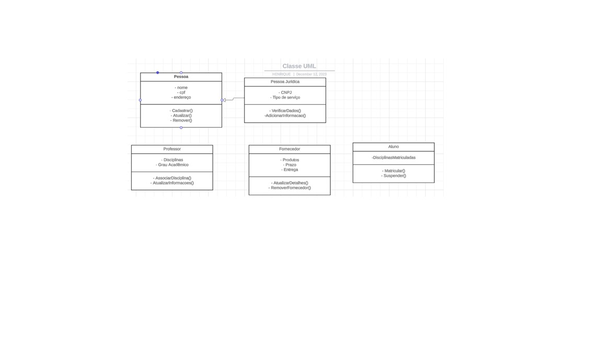

<h1>:computer: Sistema de Gestão Escolar
  
</h1>

## Desenvolvedores

- [`Gabriel Alexandre Fonseca Mendes`](https://github.com/gafmendes/)

- [`Henrique Oliveira de Carvalho`](https://github.com/GuithubHenri)

- [`Ismael Silva Rabelo`](https://github.com/)

- [`Juan Carlos de Latorre`](https://github.com/JuanCDL02)

- [`Thayna Englidy da Silva`](https://github.com/)

## Lista de funcionalidade do sistema

### Usuário Pessoa Física

- `RF-001`	Cadastrar usuário Pessoa Física:	cadastrar de usuário aluno com informações de nome, cpf e endereço

- `RF-002`	Atualizar usuário Pessoa Física:	atualizar informações do usuário Pessoa Física

- `RF-003`	Excluir usuário Pessoa Física:	excluir usuário Pessoa Física

### Usuário Pessoa Jurídica

- `RF-004`	Criar usuário Pessoa Jurídica:	cadastrar de conta com dados do perfil (nome, cnpj, endereço, tipo de serviço prestado, informações adicionais)

- `RF-005`	Atualizar usuário Pessoa Jurídica:	atualizar informações do usuário Pessoa Jurídica

- `RF-006`	Excluir usuário Pessoa Jurídica:	excluir usuário Pessoa Jurídica

### Usuário Aluno

- `RF-007`	Adicionar disciplina:	adicionar disciplina ao usuário Aluno

- `RF-008`	Matricular Aluno:	matricular o usuário Aluno à disciplina ofertada ao usuário Aluno em determinada matéria

- `RF-009`	Supender Matrícula Alun:	suspender a matrícula do usuário Aluno em determinada matéria

### Usuário Professor

- `RF-010`	Associar disciplina:	associar uma disciplina e/ou uma turma ao usuário Professor para ministrar aula

- `RF-011`	Atualizar disciplina:	atualizar uma disciplina e/ou uma turma ao usuário Professor para ministrar aula

### Usuário Fornecedor

- `RF-012`	Atualizar detalhes:	atualizar detalhes do usuário Fornecedor

- `RF-013`	Remover Fornecedor:	remover usuário Fornecedor

### 🚧 Versão 1.0.0 🚧

## :pencil: Protótipo

- Clique aqui para acessar o [`Figma`](https://www.figma.com/file/uPcBwP8cgWpLa4aJrI6XVQ/Untitled?type=design&node-id=1%3A44&mode=design&t=IMbPR79ozpXyxiof-1)
- Clique aqui para testar o [`Protótipo`](https://www.figma.com/proto/uPcBwP8cgWpLa4aJrI6XVQ/Untitled?type=design&node-id=1-44&t=6fGVyRUtMHKQZUVG-1&scaling=min-zoom&page-id=0%3A1&starting-point-node-id=1%3A44&show-proto-sidebar=1&mode=design)

## Modelo entidade relacionamento
- Clique na imagem para acessar mais detalhes sobre o modelo entidade relacionamento

